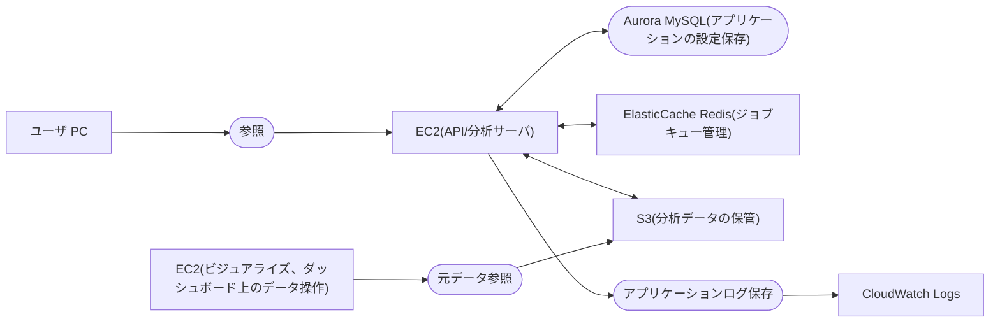

# 概要

nehan は、Amazon Web Servise（AWS）を用いて開発しており、下記の構成でサービスを提供しております。

```mermaid
%%{init:{'theme':'default'}}%%
graph LR
  userpc[ユーザ PC] --> ref([参照]) --> ec2["EC2(API/分析サーバ)"]
  ec2 <--> aurora(["Aurora MySQL(アプリケーションの設定保存)"])
  ec2 <--> redis["ElasticCache Redis(ジョブキュー管理)"]
  ec2 <--> s3["S3(分析データの保管)"]
  ec2 --> applog([アプリケーションログ保存]) --> logs[CloudWatch Logs]
  ec2_2["EC2(ビジュアライズ、ダッシュボード上のデータ操作)"] --> dataref([元データ参照]) --> s3["S3(分析データの保管)"]
```
